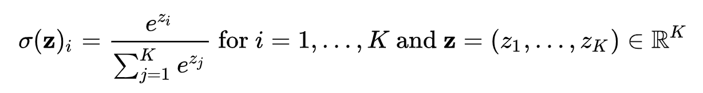

# matsum


This is a package for adding elements after numerical calculation.

## Usage

```go
package main

import (
    "math"

    "github.com/po3rin/matsum"
	"gonum.org/v1/gonum/mat"
)

func main() {
    // creates matrix.
    A := mat.NewDense(2, 2, []float64{0, 0, 0, 0})

    // prepares applied function
    f := math.Exp

    // Do !!
    result := matsum.Sum(A, f)
    // result: 4

    // ...
}
```

## Example (Softmax)

impliments Softmax function.

https://en.wikipedia.org/wiki/Softmax_function



```go
func Softmax(x mat.Matrix) mat.Matrix {
    // use matsum !!
    f := math.Exp
    expsum := matsum.Sum(x, f)

    softmax := func(i, j int, v float64) float64 {
        return math.Exp(v) / expsum
    }

    var result mat.Dense
    result.Apply(softmax, x)
    return &result
}
```

## Todo

Add RawSymmetricer case ...
